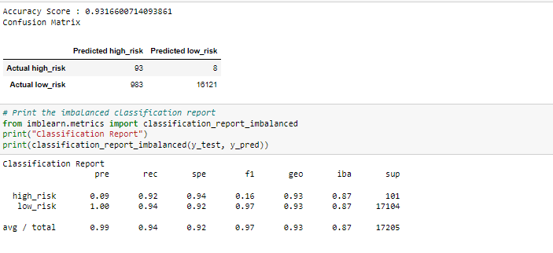

# **Supervised Machine Learning and Credit Risk** 
# **Credit_Risk_Analysis** 

## **Overview of the analysis**  

* Fast Lending, peer to peer lending services company wants to use Machine Learning to predict credit risk. Management believes this will lead to more accurate identification of good candidates for loans which will lead to lower default rates.

* In this challenge we will build and evaluate several Supervised machine learning models or algorithms to predict credit risk.
Using the credit card credit dataset from Lending Club, a peer-to-peer lending services company, we will oversample the data using the RandomOverSampler and SMOTE algorithms, and undersample the data using the ClusterCentroids algorithm. Then, we will use a combinatorial approach of over- and undersampling using the SMOTEENN algorithm. Next, we will compare two new machine learning models, BalancedRandomForestClassifier and EasyEnsembleClassifier, to predict credit risk. At the end we will evaluate the performance of these models and make recommendation on whether they should be used to predict credit risk. 

### Purpose 

- Use Resampling Models to Predict Credit Risk
- Use the SMOTEENN Algorithm to Predict Credit Risk
- Use Ensemble Classifiers to Predict Credit Risk
- Also write a Report on the  Credit Risk Analysis

## **Results** 

* describe the balanced accuracy scores and the precision and recall scores of all six machine learning 

### Random Oversampling model
 

* The accuracy score for Random Oversampling is around 62% and the precision for high_risk is low 1% ,recall is 66%  and f1 score is low 2%. the precision for low_risk is 100% and recall is 59% as there are high number of low_risk in the dataset. 

### SMOTE Oversampling model

* The accuracy score for SMOTE Oversampling is around 66% and the precision for high_risk is low 1% ,recall is 63%  and f1 score is low 2%. The precision for low_risk is 100% and recall is 69% as there are high number of low_risk in the dataset. This model is similar to the prevoi 

### Undersampling model

* The accuracy score for undersampling model is around 54% and the precision for high_risk is low 1% ,recall is 69%  and f1 score is low 1%. The precision for low_risk is 100% and recall is 40% which means there are more false positives(10340). The undersampling is worse than both random and smote oversampling.

### Combination (Over and Under) Sampling, SMOTEENN algorithm

* The accuracy score for SMOTEENN sampling is around 67% and the precision for high_risk is low 1%, recall is 77%  and f1 score is low 2%. The precision for low_risk is 100% and recall is 59% which means there are more false positives. Smoteen slightly improved recall of the high_risk. 

### Balanced Random Forest Classifier

* The accuracy score for this model is 78% and the precision for high_risk is low 3% ,recall is 69%  and f1 score is low 6%. The precision for low_risk is 100% and recall is 88% as there are low false positives(2123).

### Easy Ensemble Classifier
 

* The accuracy score for Easy Ensemble Classifier model is 93% and the precision for high_risk is 9% ,recall is 92%  and f1 score is low 16%. The precision for low_risk is 100% and recall is 94% as there are low false positives(983). For the high_risk there is also low True negative(8 out of 93).

## **Summary** 

* The random and smoten oversampling model have about same score and the precision for the high_risk is low. The undersampling model’s score is lower than both random and smote oversampling. The smoteen model has slightly higher score than all the three and slightly improved the recall of the high_risk. The Balanced Random Forest Classifier model has higher score (78%) than four previous models and improved the sensitivity of low_risk whcih means lower false positives. The Easy Ensemble Classifier model has highest accuracy score at 93%. The recall for low_risk( is 94%) is high which means low false positive. The model also improved recall for high_risk to 92 which means low false negative.

* There is a recommendation on which model to use, or there is no recommendation with a justification

  -   I recommend the Easy Ensemble Classifier model to predict credit risk since it has the highest accuracy score. With this model the recall for the high_risk is high at 92% while precision is 9%. It will predict most high_risk numbers. The company has to pay attention though as there are few actual low_risk that will be predicted as high_risk. If they are ok with this low numbers as been flagged as high_risk, they can use this model.
